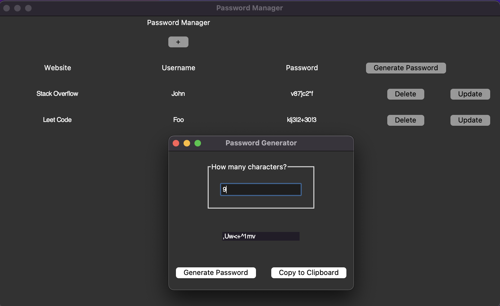

# Password Manager

Locally store all your passwords securely, so you don't have to worry about remembering them.

## TODO

- Fix window sizing cutoffs
  - Main screen is still cutoff when an entry is created (this can be fixed when update password functionality is added)
- Create one deticated GUI for creating a website/username/password input
- Create Update password functionality
- TBD

## Gallery

    Password generator popup

